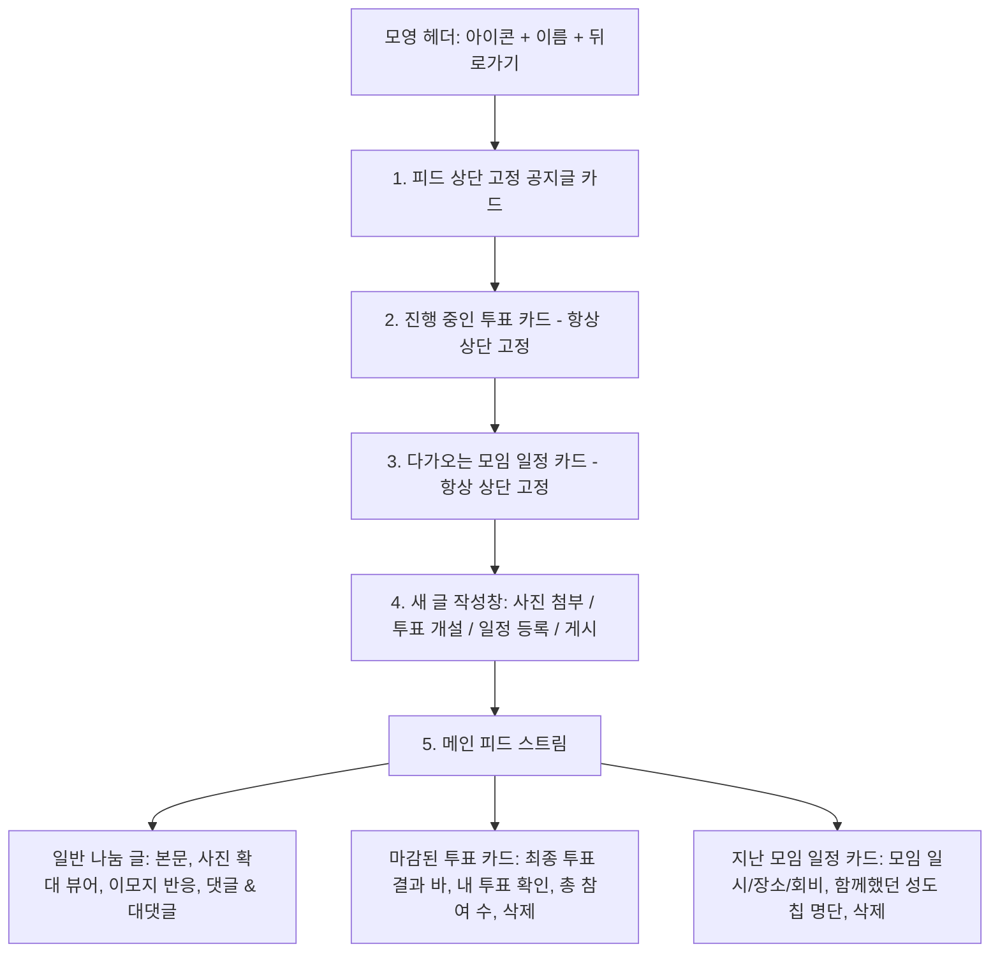

# DFMC 모영 (Moyoung) 종합 개발 및 구현 계획서 (Implementation Plan)

본 문서는 **둔산제일교회 동호회(모영) 커뮤니티 웹 플랫폼**의 기술 아키텍처, 단계별 구현 내용, 데이터 모델, 보안 권한 및 최신 기능 명세를 상세히 정리한 구현 계획서입니다.

---

## 1. 프로젝트 개요 및 기술 스택

### 1.1 프로젝트 목표
- **둔산제일교회 성도들을 위한 맞춤형 모영(동호회) 커뮤니티 플랫폼 구축**.
- 복잡한 가입 절차 없이 실명 및 셀(또는 지인) 교차 검증을 통한 진입 장벽 제로화.
- 모바일(스마트폰)과 데스크톱 모두에 최적화된 심플하고 직관적인 인스타그램 Threads 스타일의 단일 스트림 피드 제공.
- 1GB 무료 호스팅/단일 서버 환경에 최적화된 초경량 고성능 풀스택 아키텍처.

### 1.2 핵심 기술 스택
- **프론트엔드**: React 18, TypeScript, Vite, Vanilla CSS + HSL Modern Tokens, Lucide-React Icons.
- **백엔드(서버리스)**: 별도 서버 없음. `client/src/firebase/apiInterceptor.ts`가 `window.fetch`를 가로채 `/api/*` 요청을 Firestore / Storage와 직접 통신으로 처리. (`server/`의 Express + SQLite는 레거시이며 프로덕션 미사용)
- **데이터베이스**: Cloud Firestore (NoSQL). 아래 3장의 테이블 스키마는 초기 SQLite 설계이며, 현재는 동일한 필드 개념이 Firestore 컬렉션 문서로 저장됩니다 (컬렉션 목록은 `DEPLOYMENT.md` 4장 참고).
- **파일 저장소**: Firebase Storage (클라이언트에서 1200px / JPEG 75% 압축 후 업로드, 5초 타임아웃 시 Base64 폴백).
- **호스팅**: Firebase Hosting (`https://moyoung-abd47.web.app`).
- **보안 및 메일러**: EmailJS (서버관리자 2FA OTP 발송), Firestore/Storage 보안 규칙.

---

## 2. 역할 및 권한 체계 (Role & Permission)

| 역할 | 명칭 | 주요 권한 및 접근 범위 |
|---|---|---|
| `server_admin` | **서버 관리자** (`dfmc8470`) | 2FA 이메일 보안 인증, 시스템 트래픽 및 1GB 실시간 스토리지 게이지 확인, 전체 성도 명단 및 권한 부여/회수 |
| `head_admin` | **전체 관리자** (`pastor` / 김목사) | 셀 개편 관리, 팝업/공지/환영문구 설정, 모영 생성/삭제, 모영 이름 및 아이콘 수정, 미디어 관리자 선임 |
| `media_admin` | **미디어 관리자** (`user15` / 임선우) | 로비 환영 문구/슬로건, 대상별 맞춤 환영 문구, 교회 팝업창 설정, 교회 전체 공지 전담 관리, 부적절한 글/댓글 삭제 |
| `is_leader` | **모영 총무** (모영당 최대 3인) | 피드 상단 고정(`📌`), 팝업 모달 기반 투표 개설 및 마감/삭제, 모임 일정 등록/삭제, 총무 2인 자율 협의/위임 안건 발의 |
| `member` | **일반 성도** (`~님` 호칭) | 피드 글 작성(사진 단독 게시 가능), 댓글 및 대댓글 작성, 투표 참여(선택+확인), 모임 일정 참석 신청, 이모지 반응 |

---

## 3. 데이터 모델 설계 (Database Schema)

> 아래는 초기 SQLite 기준 설계이며, 현재 프로덕션은 Firestore 컬렉션(`club_comments`, `club_views`, `club_chat`, `reports` 등 명칭 일부 상이)으로 동일한 개념을 저장합니다. 정확한 컬렉션명은 `client/src/firebase/apiInterceptor.ts`를 기준으로 확인하세요.

### 3.1 셀 및 회원 관리
- **`cells`**: `id`, `name`, `created_at`
  - **'둔산제일교회'는 1번 고정 기본 셀**로 영구 보존.
- **`users`**: `id`, `username`, `password_hash`, `name`, `cell_name`, `role`, `cell_verified`, `created_at`

### 3.2 로비 및 관리자 설정
- **`lobby_settings`**: `welcome_tagline`, `welcome_message`, `updated_at`
- **`targeted_welcome_messages`**: `id`, `group_name`, `welcome_tagline`, `welcome_message`, `user_ids`, `is_active` (1인 1그룹 배타적 배정)
- **`popups`**: `id`, `title`, `content_text`, `image_url`, `end_date`, `is_active`
- **`notices`**: `id`, `title`, `content`, `author`, `is_pinned`, `created_at`

### 3.3 모영(클럽) 및 커뮤니티 피드
- **`clubs`**: `id`, `name`, `description`, `icon`, `manager_names`, `created_at`
- **`club_posts`**: `id`, `club_id`, `user_id`, `user_name`, `user_cell`, `content`, `image_url`, `is_pinned`, `created_at`
- **`club_post_comments`**: `id`, `post_id`, `user_id`, `user_name`, `user_cell`, `content`, `parent_comment_id`, `created_at`
- **`club_reactions`**: `id`, `target_type` ('post', 'comment', 'schedule'), `target_id`, `user_id`, `emoji` ('amen', 'heart', 'like', 'fire', 'smile')
- **`club_polls`**: `id`, `club_id`, `title`, `description`, `options` (JSON), `end_date`, `is_closed`, `created_at`
- **`club_poll_votes`**: `id`, `poll_id`, `user_id`, `user_name`, `selected_option`, `voted_at`
- **`club_schedules`**: `id`, `club_id`, `title`, `event_date`, `location`, `fee_info`, `attendees` (JSON), `is_pinned`, `created_at`
- **`club_handover_votes`**: `id`, `club_id`, `action_type`, `proposer_id`, `target_user_id`, `agree_user_ids` (JSON), `status`

---

## 4. 모영(Club) 화면 레이아웃 및 UX 흐름

피드는 불필요한 탭 전환을 없애고 인스타그램 Threads 스타일의 세련된 단일 수직 스트림으로 구성됩니다:

---

## 5. 단계별 상세 구현 내역 (1단계 ~ 26단계)

### [1~6단계] 인프라, 인증, 로비 및 모영 대시보드
- SQLite WAL 모드 기반 1GB 최적화 경량화 Monorepo.
- 아이디 + 성도 실명 기반 비밀번호 없는 간편 로그인.
- 서버 관리자 전용 이메일 2FA 5자리 보안 인증 및 침입 감지 알림.
- 로비 단일 공지, 상시 팝업창, 4대 모영(풋살, 배드민턴, 볼링, 독서) 초기화.
- 하단 고정 바텀 내비게이션 바 제거 및 헤더 우측 [내 정보] 모달 신설.

### [7~12단계] 피드 개편, 헤더 간소화 및 권한 체계 고도화
- 카카오톡 스타일의 두꺼운 외곽 테두리를 제거하고 테두리 없는 자연스러운 메시지 행 구조 도입.
- 모영 이름 수정 권한을 전체 관리자(`head_admin`, `server_admin`) 전용으로 분리.
- 환영/팝업/공지 문구의 필수 입력 제약을 해제하여 빈 텍스트 저장 허용.

### [13~18단계] 맞춤 환영 문구 및 실시간 연동
- 새가족 등록자, 말씀양육 결단자, 말씀양육 수료자 등을 위한 **"🎯 대상별 맞춤 환영 문구"** 신설.
- **성도 1인당 1개 맞춤 문구 배타적 지정 원칙**: 타 그룹에 이미 포함된 성도는 선택 목록 최하단에 회색(`disabled`) 처리하여 중복 노출 원천 방지.
- 불필요한 "즉시 활성화" 체크박스 제거 (기본 활성 정책).

### [19~22단계] Kebab 메뉴, 인라인 수정, 파일 탐색기 업로드
- **피드 상단 고정 기능**: 총무/관리자가 중요 글, 투표, 일정을 피드 상단에 고정 가능.
- **Kebab 메뉴 (`...`) 일원화**: 작성자 본인에게는 `[수정]`, 관리자에게는 `[삭제]`, 총무에게는 `[상단 고정]` 제공.
- **글 없는 사진 단독 게시**: 텍스트 없이 사진만 올려도 등록 가능.
- **OS 파일 탐색기 / 스마트폰 앨범 연동**: `POST /api/clubs/upload-image` 엔드포인트 구축 (15MB 제한).

### [23단계] 댓글 이모지 오류 수정, 팝업 투표/일정 등록 및 상단 고정 배치
1. **댓글 Smile(웃는 얼굴 😊) 이모지 오류 해결**: `validEmojis`에 `'smile'` 추가 및 댓글 반응 쿼리 확장.
2. **피드 내 팝업 모달 등록**: 권한자가 작성창의 `[투표 개설]`, `[일정 등록]` 버튼을 눌러 팝업 모달에서 직관적으로 생성.
3. **중요 공지 체크박스 제거**: 작성창 체크박스를 없애고 Kebab 메뉴의 고정 기능으로 일원화.
4. **고정된 공지 가시성 개선**: 블루 그라디언트(`linear-gradient(#eff6ff, #dbeafe)`), 선명한 5px 좌측 블루 바, 입체적 그림자 적용.
5. **진행 중인 투표와 일정 상단 고정**: 고정 공지 배너 바로 아래에 진행 중인 투표와 일정을 항상 최우선 노출.
6. **내 정보 모달 셀 목록 제거**: `MyInfoModal.tsx`에서 자동 완성 버튼 그리드를 삭제하고 깔끔한 1줄 수기 입력만 유지.

### [24단계] 등록된 셀 명단 '둔산제일교회' 영구 고정 및 셀 개편 보호
1. **DB 및 시드 레벨 영구 고정**: `cells` 테이블 기본값에 `'둔산제일교회'`를 상시 포함하고 초기화/마이그레이션 시 자동 보존.
2. **셀 개편 시 자동 영구 보존**: 관리자가 어떤 셀 목록을 입력하고 개편하더라도 백엔드 트랜잭션에서 무조건 `'둔산제일교회'`를 1번으로 자동 삽입 및 보존.
3. **단일 삭제 방지**: `DELETE /api/head-admin/cells/:id`에서 `'둔산제일교회'` 삭제 시도 시 400 Bad Request 차단.
4. **관리자 UI 보호**: 관리자 페이지 셀 목록에 `[고정 기본]` 뱃지와 `🔒` 아이콘 적용, 셀 개편 모달에서도 비활성화 보호 처리.

### [25단계] 최상단 인위적 배너 창 제거 및 피드 순서 정상화
1. **최상단 인위적 배너 창 완전 제거**: `[📌 고정 공지] ... X` 배너를 삭제하고 순수 스레드 피드 카드로만 표시.
2. **올바른 순서 정상화**:
   - 1위치: **고정된 공지/게시글 (`pinnedPosts`)** (최상단 피드 카드 배치)
   - 2위치: **진행 중인 투표 (`activePolls`)** (고정 공지 바로 아래)
   - 3위치: **다가오는 모임 일정 (`activeSchedules`)** (투표 바로 아래)
   - 4위치: **새 스레드 작성창** (총무/관리자 작성 영역)
   - 5위치: **메인 피드 스트림 (`feedTimeline`)** (최신순 연대기 스트림)

### [26단계] 마감된 투표 및 지난 일정 피드 통합 노출 (신규 완료)
1. **통합 피드 스트림 (`feedTimeline`)**: 일반 게시글, 마감된 투표, 지난 모임 일정을 하나의 연대기 배열로 결합하여 최신순 정렬.
2. **마감된 투표 카드 (`renderClosedPollCard`)**:
   - 수동 마감되었거나 기한이 만료된 투표 자동 이동.
   - `[📊 마감된 투표]` 뱃지, 선택지별 득표율 게이지 바, 본인 투표 확인 태그(`[✓ 내 투표]`), 총 투표자 수 표시.
   - 총무/관리자 삭제 버튼 제공.
3. **지난 모임 일정 카드 (`renderPastScheduleCard`)**:
   - 일시가 지난 모임 자동 이동.
   - `[📅 지난 모임 일정]` 뱃지, 일시/장소/회비 정보, `[✓ 참석함]` 뱃지, 함께했던 성도 칩 목록 표시.
   - 총무/관리자 삭제 버튼 제공.

### [27단계] 투표 마감 기능 완비 (자동/수동 마감, 홈 화면 제거, 상단 고정 해제, 지난 피드 보존) (신규 완료)
1. **기한 만료 시 자동 마감**: 투표 마감 일시(`end_date`)가 지나면 DB 및 조회 레벨에서 자동으로 `is_closed = 1`, `is_pinned = 0` 처리.
2. **권한자 수동 마감 완비**: 모영 총무/관리자가 `[마감하기]` 버튼 클릭 시 `PUT/POST /api/clubs/:id/polls/:pollId/close` 호출을 통해 즉시 마감 및 고정 해제.
3. **홈 화면 '투표 진행 중인 모영' 즉시 제거**: 마감되거나 기한이 지난 투표는 로비 화면 목록에서 즉시 필터링되어 노출 제외.
4. **모영 피드 상단 고정 제거**: `activePolls` 상단 고정 카드 목록에서 마감된 투표 자동 제외.
5. **지난 피드(타임라인) 보존**: 통합 피드 스트림(`feedTimeline`)의 `renderClosedPollCard`로 자동 이동하여 선택지별 득표율, 총 투표자 수, `[✓ 내 투표]` 확인 가능.

### [28단계] 모임 일정 댓글 기능, '참석자' 문구 개편 및 피드 작성창 최상단 배치 (신규 완료)
1. **모임 일정 댓글 기능 전면 지원**:
   - 다가오는 모임 일정(`activeSchedules`) 및 지난 모임 일정(`pastSchedules`) 카드 모두에 댓글 토글, 댓글 목록, 대댓글, 이모지 반응(하트/좋아요/웃음), 삭제 기능 통합 구축.
   - `POST /api/clubs/:id/schedules/:scheduleId/comments` 엔드포인트 연동 완료.
2. **'참석 성도' 문구 간소화**:
   - 다가오는 모임 일정 및 지난 모임 일정 카드의 명칭을 직관적인 **`참석자 (N명):`**로 변경.
3. **피드 레이아웃 순서 최적화**:
   - 총무/관리자의 **새 글 작성창(스레드 작성, 사진 첨부, 투표 개설, 일정 등록)**을 고정 공지, 진행 중인 투표, 모임 일정보다 **가장 최상단**에 위치하도록 재배치.

### [29단계] 셀 개편 모달 선택식 ➡️ 수기 작성 검증식으로 개편 (신규 완료)
1. **드롭다운 선택식 완전 제거**: 셀 목록이 외부인에게 노출되는 보안 취약점을 방지하기 위해 셀 선택 `<select>` 드롭다운을 완전히 삭제.
2. **수기 작성(직접 입력) 검증 전환**: 성도가 직접 자신의 소속 셀(예: `1청년부 2셀`, `장년 1셀` 등)을 1줄 텍스트로 작성하도록 변경.
3. **서버 검증 보안 강화**: 에러 메시지에 전체 셀 명단이 유출되지 않도록 필터링하고, 성도들의 띄어쓰기 오차(예: `1청년부 2셀` vs `1청년부2셀`)를 스마트하게 인식하여 공식 명칭으로 자동 매핑·승인.

---

## 6. 테스트 계정 안내

| 역할 | 아이디 | 성도 실명 | 비밀번호 | 비고 |
|---|---|---|---|---|
| **서버 관리자** | `dfmc8470` | `서버관리자` | (2FA 이메일 인증) | 최상위 보안 계정 |
| **전체 관리자** | `pastor` | `김목사` | - | 비밀번호 없는 간편 로그인 |
| **미디어 관리자** | `user15` | `임선우` | - | 환영문구/팝업/공지/댓글삭제 전담 |
| **풋살 모영 총무** | `user1` | `이주환` | - | 피드 작성, 사진 업로드, 투표/일정 개설 및 고정 |
| **일반 성도** | `user4` | `박민수` | - | 피드 열람, 투표/일정 참여, 댓글/대댓글/반응 |

---

## 7. 실행 및 서비스 포트
- **🌐 프로덕션 웹사이트 (Firebase Hosting)**: **`https://moyoung-abd47.web.app`** (컴퓨터 전원 무관, 상시 가동)
- **로컬 Vite 클라이언트**: `cd client && npm run dev`
- **프로덕션 빌드/배포**: `cmd /c "npm run build && npx firebase deploy --only hosting"` (배포 대상 `client/dist`)
- 배포/운영 상세는 `DEPLOYMENT.md`, 파일별 수정 가이드는 `ARCHITECTURE_AND_FILE_MAP.md` 참고.
